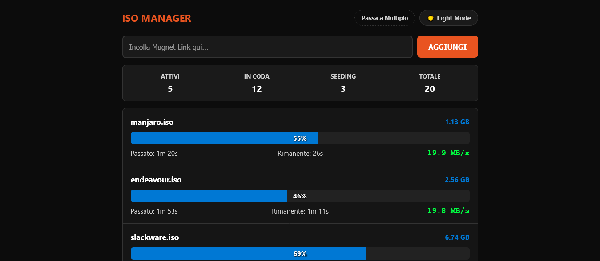
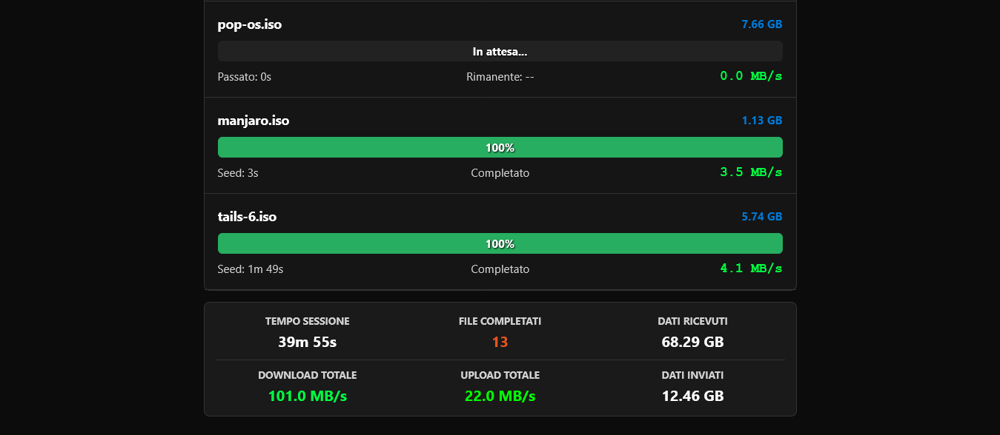
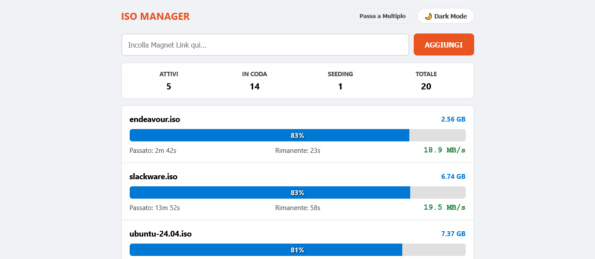
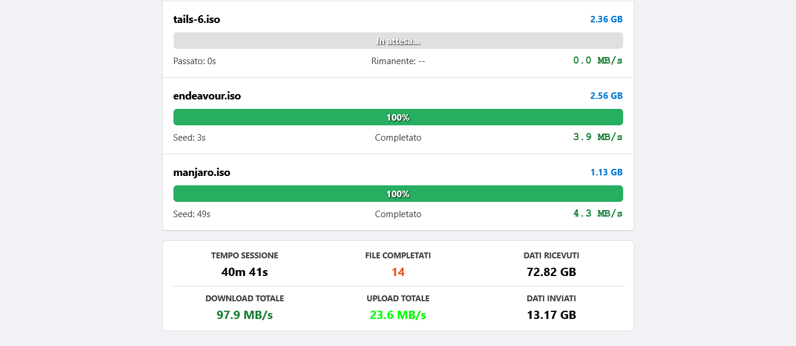
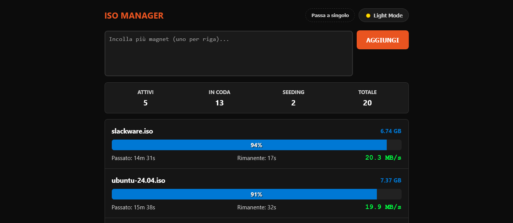

# ISO Manager

 

**[English version available here](README.md)**

**ISO Manager** è un simulatore avanzato di gestione download torrent, progettato per emulare l'esperienza d'uso di un client BitTorrent moderno direttamente nel browser. Il progetto si focalizza sulla gestione dinamica delle code, la visualizzazione in tempo reale delle statistiche di rete e l'automazione del workflow di download e seeding.

## ✨ Aggiornamenti Recenti e Raffinamento UI

L'ultima iterazione del progetto ha introdotto miglioramenti significativi focalizzati sull'usabilità e sulla precisione della gestione delle code:

### 🧩 Troncamento Centrale Dinamico (Middle-Truncation)
Per garantire la massima leggibilità su ogni dispositivo, è stata implementata una logica di visualizzazione intelligente dei nomi dei file. A differenza dei metodi standard che tagliano il testo alla fine, ISO Manager utilizza una combinazione di **JavaScript e Flexbox CSS** per preservare sempre l'estensione e gli ultimi caratteri del file. Il sistema valuta dinamicamente lo spazio disponibile: se il nome rientra nell'area visiva appare intero, altrimenti viene applicato un taglio con ellissi esattamente al centro, garantendo un'estetica pulita sia su Desktop che su Mobile.

### 🗑️ Gestione Selettiva e Coda Dinamica
Il controllo sulla lista dei download è stato potenziato con nuove funzionalità:
* **Cancellazione Manuale:** È ora possibile rimuovere singoli torrent direttamente dalla coda (stato "In attesa").
* **Blacklist Intelligente:** Se un utente elimina una delle distro predefinite caricate all'avvio, il sistema la inserisce automaticamente in una blacklist temporanea. Questo impedisce al software di re-inserire lo stesso file durante i cicli di riempimento automatico della sessione corrente.
* **Flessibilità del Fill-Limit:** All'avvio l'applicazione rispetta rigorosamente il `FILL_LIMIT` configurato (default 20), ma permette all'utente di ridurre volontariamente la dimensione della coda tramite eliminazione manuale, senza forzare il ripristino di file non richiesti.

### 📱 Ottimizzazione Mobile First
L'interfaccia è stata raffinata per il tocco (touch-friendly). I controlli di ordinamento (Sposta Su/Giù) e il pulsante di rimozione sono stati ridimensionati e distanziati per evitare tocchi accidentali, migliorando l'esperienza d'uso su smartphone.

## 🌐 Demo Online

Puoi provare l'applicazione direttamente dal tuo browser al seguente indirizzo:
👉 **[https://smal82.github.io/ISO-Manager/](https://smal82.github.io/ISO-Manager/)**

## 📸 Anteprima Interfaccia

## 🚀 Caratteristiche Principali

L'interfaccia di ISO Manager è studiata per offrire la massima flessibilità: è possibile alternare istantaneamente la grafica tra **modalità chiara e scura** per adattarsi alle preferenze visive dell'utente. Il sistema di inserimento è duale e intelligente: l'utente può scegliere di incollare un singolo magnet link o attivare la modalità multipla per processare **intere liste di magnet in una sola volta**. Una volta aggiunti, i torrent vengono gestiti da un sistema di code automatico con progress bar animate e stati differenziati (In attesa, Download, Seeding), mantenendo la lista sempre ordinata per stato e tempo rimanente (ETA).

## 🧠 Analisi e Algoritmi Implementati

Il realismo della simulazione è garantito da una serie di processi logici integrati che operano in modo sinergico.

### Euristica di Rilevamento Rete

All'apertura della pagina, il sistema avvia immediatamente una procedura di analisi euristica fondamentale per calibrare l'intera esperienza. Questo processo esegue un fingerprinting del dispositivo incrociando i dati tecnici del browser con le capacità teoriche della connessione rilevata in quel momento. Se l'accesso avviene da un sistema desktop, l'algoritmo forza l'utilizzo di un profilo ottimizzato per Fibra Ottica, ignorando le limitazioni di risparmio dati tipiche dei dispositivi mobili. I risultati di questa analisi sono determinanti: vengono utilizzati per calibrare i limiti massimi di banda (download e upload globali) e per impostare la velocità dei peer simulati, garantendo che le prestazioni visibili siano sempre coerenti con l'hardware e la rete effettiva dell'utente.

### Gestione delle Code e Scheduling

Il sistema implementa un algoritmo di scheduling basato su una coda FIFO (First-In, First-Out) condizionata. Monitora in tempo reale il numero di processi attivi e avvia automaticamente i torrent in attesa solo quando si liberano slot di banda, rispettando i limiti di stabilità definiti durante la fase di calibrazione iniziale.

### Distribuzione della Banda e Parsing

La simulazione del traffico dati avviene tramite un algoritmo di allocazione dinamica che ripartisce la velocità globale tra tutti i download attivi. Per evitare una progressione lineare e innaturale, viene applicato un fattore di jitter casuale che simula le micro-variazioni tipiche dei protocolli P2P. Parallelamente, ogni link inserito viene analizzato tramite espressioni regolari per estrarre il parametro *Display Name* (dn); questo valore viene decodificato dal formato URL per assegnare automaticamente a ogni file il suo nome corretto e leggibile.

### Logica di Ordinamento Multi-Livello

Per garantire una gestione visiva ottimale, i torrent vengono costantemente riorganizzati secondo una gerarchia a due chiavi. La priorità principale è dettata dallo stato del processo (Download attivi in cima, code al centro e Seeding in fondo alla lista), mentre la priorità secondaria ordina i file all'interno dello stesso gruppo in base al tempo stimato alla conclusione (ETA).

## 📄 Licenza

Questo progetto è distribuito sotto licenza **MIT**. Puoi consultare il testo completo della licenza direttamente qui:
[MIT License - ISO Manager](https://github.com/smal82/ISO-Manager/blob/main/LICENSE)
